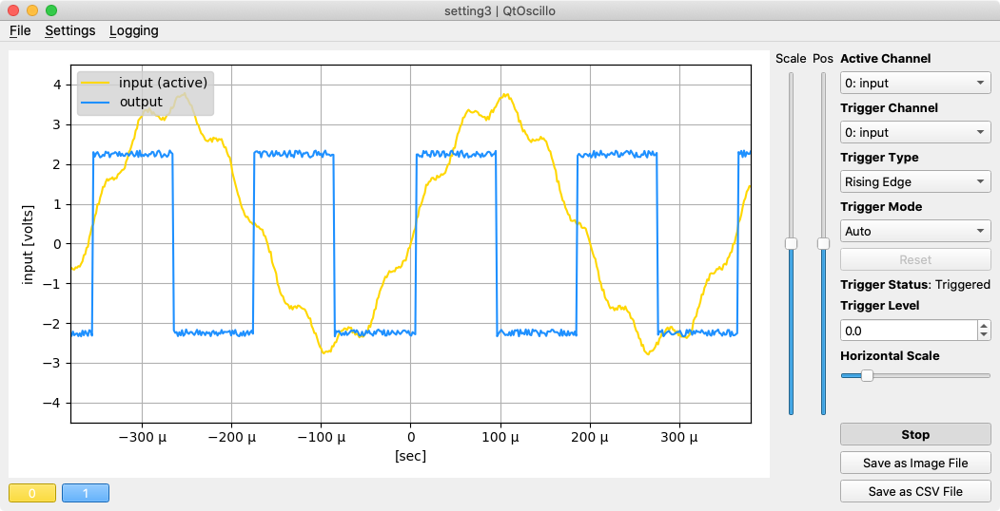
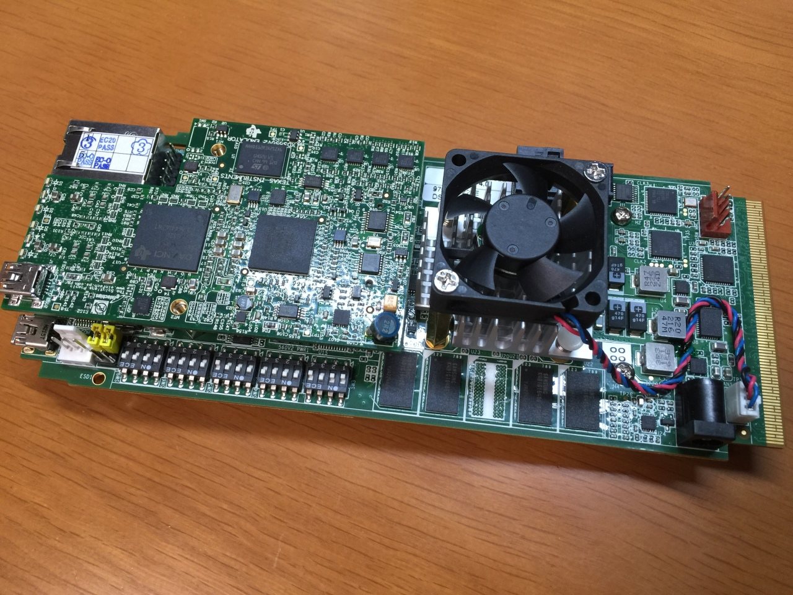

# OscilloDSP, a Virtual Oscilloscope Software for Jupyter and Embedded Processors

Copyright (c) 2020, 2021, Chubu University and Firmlogics

All rights reserved.

[Watch the demo video on YouTube.](https://www.youtube.com/watch?v=cJITVeQGVG0)

## What is OscilloDSP?

OscilloDSP is a software tool that allows users to visualize data from embedded processors, such as DSPs (Digital Signal Processors), in a way similar to an oscilloscope. It sends sensor values, computed data, or other real-time information from the embedded processor to a PC, where Python-based visualizations are generated. This is especially useful for engineers and researchers working on embedded systems, who need to analyze data from sensors or signal processing units in real-time.

## Latest Environment Compatibility

After a period of inactivity, the software has been updated and confirmed to work in the latest environments:

- **Debian 12 + Python 3.12.6**: Works without any modifications.
- **macOS 10.15 + Python 3.9**: Requires the following changes in `hostapp/qt-requirements.in` to work:

  - `PySide6<6.3`
  - `numpy<2`

  Additionally, Python 3.12 is not supported by PySide6 6.2, so you need Python 3.10 or earlier (Python 3.9 is recommended).

### Notes

While it works with Python 3.10 on macOS, the `grpcio` tools do not have pre-built wheels available for CPython 3.10 on PyPI [as of this version](https://pypi.org/project/grpcio/1.66.2/#files), which makes `pip install` slower.

## Who is it for?

This software is designed for:
- Engineers working on DSP or other embedded systems.
- Researchers in signal processing who need to visualize real-time data.
- Developers looking for an oscilloscope-like tool to monitor and analyze data directly from microcontrollers or other embedded processors.

## Motivation for Development

OscilloDSP was created to bridge the gap between embedded systems and real-time data visualization. Traditional oscilloscopes can be limited in terms of how much data they can handle and visualize from multiple sources. With OscilloDSP, users can manage large amounts of data, select the relevant information needed for visualization, and do so with a flexible Python environment. It also supports simulations for those without access to physical DSP hardware, making it versatile for both development and educational purposes.

## How does it help?

OscilloDSP reduces the communication load between an embedded processor and a PC by only sending the necessary data for visualization. It also offers flexibility in how data is visualized, with built-in support for multi-channel data display. It can be simulated on a PC without requiring DSP hardware, which is ideal for testing and development. Additionally, it leverages Google Protocol Buffers for efficient data encoding and decoding between the embedded processor and the PC.

## Documentation

| 日本語 | English |
|--------|---------|
| [インストール方法](hostapp/docs/installation.md) | [Installation Guide](hostapp/docs/installation_en.md) |
| [使い方](hostapp/docs/usage.md) | [How to Use](hostapp/docs/usage_en.md) |
| [パソコン用のオシロスコープアプリ](hostapp/oscillo.ipynb) | [Oscilloscope app for PC](hostapp/oscillo_en.ipynb) |

## Known Issues

- When using pyenv, you may not be able to run `nanopb_generator` after installing with `pip-sync` unless you run `pyenv rehash`.

- The section on “Disabling Jupyter cell auto-scrolling” in Jupyter notebooks appears to no longer be functional with recent Jupyter versions.

- In Jupyter, the control panel and the Matplotlib plot screen do not align horizontally as they used to. The issue may be traceable by investigating version differences, but due to the complexity of designing a detailed GUI with IPyWidgets, I am considering dropping support for Jupyter with OscilloDSP.

- When running the Qt-based application qtoscillo.py with PySide6 6.7.3 on Debian, the application may not exit properly when selecting Quit from the menu. It appears to work fine with PySide6 6.2.4 on macOS.

## License

This project is licensed under the BSD 2-Clause License.
See the [LICENSE](LICENSE) file for more details.
