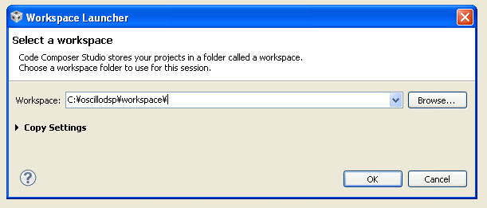
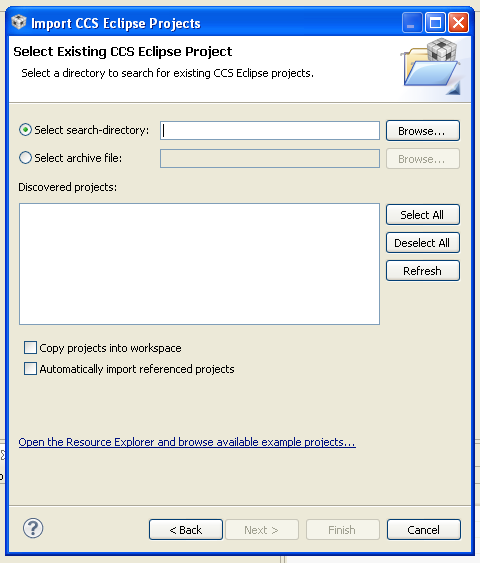

# TI Code Composer Studio によるデモアプリの実行方法

ここでは、Code Composer Studio（以下、CCS）のバージョン 5.5.0 を使用しています。
CCS プロジェクトをより新しいバージョンに移行することは可能と思いますが、TI C66x は CCS 5.5.0 で問題なく利用できます。
なお、CCS 5.5.0 は Windows 10 などの新しい OS でサポートされていませんが、インストールも実行にも大きな支障はありません。
（ただし、TI は動作保証していないと思います。）

**なお、現状は TI C6678 EVM 用のプロジェクトしか用意されていません。C6657 など他の DSP では、そのままでは動作しません。**

## CCS の起動とデモプログラムのビルド

CCS を起動し、ワークスペースを指定します。

メニューの File → Switch Workspace で、oscillodsp 下の workspace ディレクトリを指定し、OK ボタンを押します。



続いて、メニューから File → Import... を選びます。
ダイアログが開いたら、Code Composer Studio のツリーを展開し、Existing CCS Eclipse Projects を選び、Next > ボタンを押します。

次のようなダイアログが開きますので、Select search-directory の右にある Browse... ボタンを押します。



そうしたら、workspace ディレクトリ下の oscillodemo ディレクトリを選んで OK を押します。
元のダイアログに戻ったら、以下を確認し、Finish ボタンを押します。

- Discovered projects の中の oscidemo にチェックが付いていること
- Copy project into workspace のチェックが**外れている**こと

Project Explorer に oscillodep プロジェクトが表示されますので、その下の、```main.c``` をダブルクリックして開きます。


ファイルを見ると分かるように、ここでは UART の分周器でプリ分周器の 16 を指定し、さらにビットレートに 2083333 bps を指定しています。
これは、必要に応じて変更してください。

続いて、Project Explorer の oscillodemo をマウスで右クリックし、Build Project を実行します。
最初は時間がかかりますが、数分以内にバイナリファイル ```Debug\oscillodsp.out``` が生成されるはずです。

EVM のコネクタ（ここでは、子亀のメザニンエミュレータを使用します）とパソコンを USB ケーブルで接続し、EVM の電源を投入します。
CCS のメニュー File → Target Configurations から C6678 EVM 用の設定を選び、Launch Selected Configuration を選びます。

次のような画面が出たら、今回はコア #0 を使用しますので、それを選び、メニューから Run → Connect Target します。


続いて、メニューから Run → Load Program を選びます。
ダイアログ画面が出ますので、```C:\oscillodsp\workspace\oscillodemo\Debug\oscillodemo.out``` などを選び、OK します。

## ブレークポイントの設定

DSP がパソコンと通信時に、UART のエラーが発生することがありますので、エラーが起きたことが分かるように、いくつかブレークポイントを指定します。

> OscilloDSP ライブラリの、現状の通信ライブラリには、エラー検出や再送機能がないので、1ビットでも通信エラーが起きると動作が異常になることがあります。
> 通信エラーが出る場合には、通信速度（ビットレート）を下げて試してみてください。

行左の行番号は、目安です。（今後のリリースのファイル更新により、行番号が変わるかも知れません。）
CCS で uart.c を開き、CCS の画面上で行番号をダブルクリックするとブレークポイントが設定されます。

```
129:             p->n_errors ++;
140:                 p->rx_overrun ++;
146:             p->n_errors ++;
228:             p->tx_overrun ++;
```

最後に、Run → Resume でプログラムが動作開始します。
