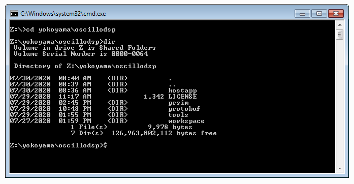
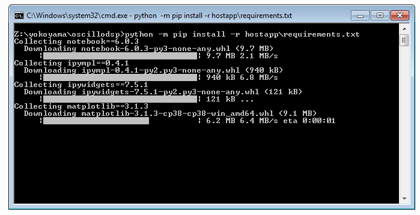
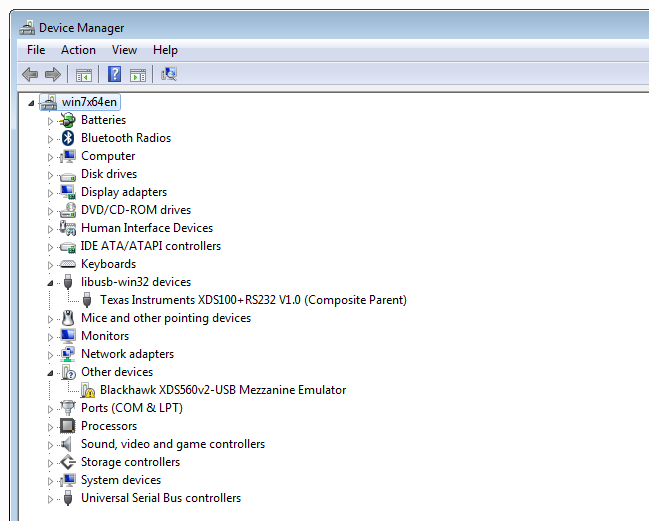
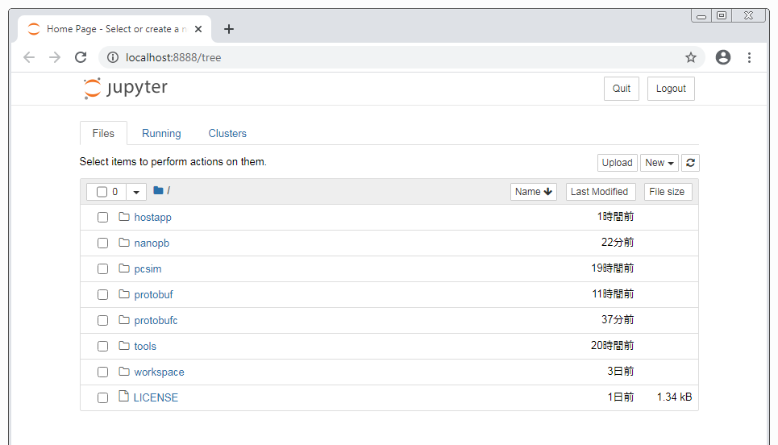
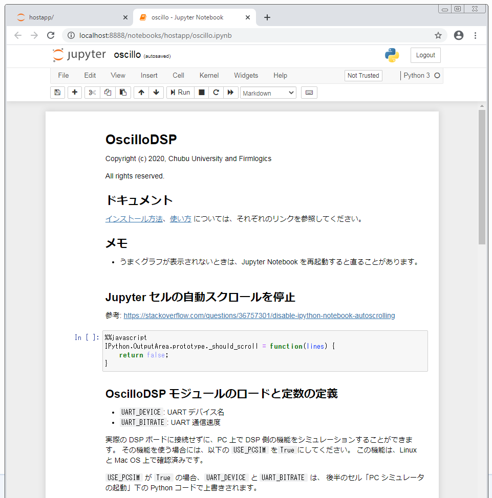

# インストール方法（Windows 編）

ここでは、Windows OS 上に環境一式をインストールする方法を説明します。

## Python のインストール

Python は、**おそらく**バージョン 3.7 以降であれば OscilloDSP に対応しますが、今回は安定最新版の 3.8.5 をインストールします。

[ここのウェブサイト](https://www.python.org/downloads/windows/) から、Python をダウンロードします。今回は Python 3.8.5 Windows x86-64 executable installer を使用します。
インストールの際は、以下の画面で**「Add Python 3.8 to PATH」にチェックマークを入れ**、Install Now をクリックします。
インストールが完了したら、PATH を有効にするため、**一度 Windows からログオフして、再度ログインします**。


## 必要な Python ライブラリのインストール

まず、今回提供させて頂く OscilloDSP のパッケージ（oscillodsp_*.zip など）を展開します。

Windows の cmd.exe を実行し、いわゆる DOS 窓を開きます。
展開したパッケージは次のようなディレクトリ構成になるので、oscillodsp ディレクトリに cd します。

```
oscillodsp/
├── hostapp
│   └── oscillodsp
├── pcsim
├── protobuf
├── tools
└── workspace
    └── oscillodemo
```



> **注意**
>
> 以下を実行すると、既にインストール済みの各種 Python ライブラリが上書きされる可能性があります。
>
> また、Matplotlib や Ipywidgets はバージョンの更新が頻繁で、バージョンの相違で動作が異なることがあるため、
> できるだけ [requirements.txt](requirements.txt) で記述しているバージョンのライブラリを使用してください。
>
> なお、より新しいバージョンのライブラリで動作確認をなさった場合は、作者（contact@flogics.com)まで御一報頂けると幸いです。

続いて、以下のコマンドを実行します。
（以下、```Z:\yokoyama\oscillodsp>``` 等を cmd.exe のプロンプトとします。）

```
Z:\yokoyama\oscillodsp> python -m pip install -r hostapp\requirements.txt
```

次のような画面となり、数分でインストールが完了します。



## PyFtdi のセットアップ

このままでは PyFtdi ライブラリが動作しないので、[PyFtdi のサイト](https://eblot.github.io/pyftdi/installation.html)に従ってセットアップします。

USB ドライバを容易に切り替えられるよう、[Zadig](https://zadig.akeo.ie/)というツールを使います。
ウェブサイトからツールをダウンロードし、実行します。
（今回はバージョン 2.5 を使用しました。）


今回は、C6678 EVM ボード上の（子亀のメザニンエミュレータでは**なく**）**ボード本体**にある USB コネクタをパソコンに接続し、
ボード上の FTDI FT2232H を使用することにします。
なお、ヘッダピンを設定し、DSP の UART が FT2232H と繋がるようにします。（工場出荷時は、そのようになっています。）

PyFtdi のサイトの指示に従い、

1. メニューから Options → List All Devices をチェックします。
2. Options → Ignore Hubs or Composite Parents のチェックを外します。
3. ドロップダウンメニューから、「Texas Insturuments XDS100+RS232 V1.0 (Composite Parent)」を選びます。


4. Driver と表示されている右に、赤い矢印の両脇に「現在のドライバ」と「インストールしたいドライバ」が表示されていますので、
インストールしたいドライバとして libusb-win32 を選びます。（上下の小さい三角ボタンで選択できます。）
5. Repace Driver ボタンをクリックします。
6. しばらく反応がありませんが、数十秒ほど待ちます。
7. Warning - System Driver という警告が出ますが、Yes ボタンを押してインストールします。
8. Zadig を終了します。
9. コントロールパネルからデバイスマネージャを開き、libusb-win32 devices というツリーの下に正しく設定されていることを確認します。



## Protocol Buffers コンパイラと Nanopb のインストール

OscilloDSP では、Google [Protocol Buffers](https://developers.google.com/protocol-buffers) という仕組を使って、パソコンと DSP が通信します。
Protocol Buffers（以下、protobuf）では、*.proto というプロトコル仕様ファイルを記述して protobuf コンパイラに渡すと、
C 言語や Python で使用できるソースコードやヘッダファイルを自動的に生成してくれます。
さらに、今回はさらに [Nanopb](https://github.com/nanopb/nanopb) という、組込プロセッサ向けにコンパクトに設計された、
特殊な protobuf コンパイラも利用します。

なお、OscilloDSP パッケージには、予め生成された（以下の）ファイルを添付していますので、*.proto ファイル（および、*.options ファイル）
を修正しない場合には、protobuf コンパイラと Nanopb のインストールは不要ですが、インストールをお勧めします。

- hostapp/oscillodsp/oscillodsp_pb2.py
- pcsim/oscillodsp.pb.c
- pcsim/oscillodsp.pb.h
- workspace/oscillodemo/oscillodsp.pb.c
- workspace/oscillodemo/oscillodsp.pb.h

まずは、Google オリジナルの protobuf コンパイラをインストールします。
[ここのウェブサイト](https://github.com/protocolbuffers/protobuf/releases)から、protoc-3.12.4-win64.zip をダウンロードし、
oscillodsp ディレクトリの直下に展開します。
展開したら、ディレクトリ名を ```protobufc``` に変更します。末尾の c を忘れないように付けてください。
（protobuf というディレクトリが既に存在するためです。）
以下のようなディレクトリ構造になっていることを確認してください。（bin と include の場所に注意してください。）

```
oscillodsp/
├── hostapp
├── pcsim
├── protobuf
├── protobufc
│   ├── bin
│   └── include
```

続いて Nanopb を[ここ](https://github.com/nanopb/nanopb/releases/tag/0.4.2)からダウンロードします。
zip 形式が便利でしょう。
このファイルを展開し、さらにディレクトリの名称を変更し、次のようなディレクトリ構成になるようにします。（一部ディレクトリやファイルを省略しています。）

```
oscillodsp/
├── hostapp
├── nanopb
│   ├── SwiftPackage
│   ├── conan-wrapper
│   ├── docs
│   ├── examples
│   ├── extra
│   ├── generator
│   ├── spm-test
│   ├── tests
│   └── tools
├── pcsim
├── protobuf
├── protobufc
```

### protobuf コンパイラと Nanopb のテスト

ここでは実際に、protobuf コンパイラと Nanopb をテストしてみましょう。
（OscilloDSP パッケージに付属のファイルを使う場合は、省略しても結構です。）

予め、（OscilloDSP パッケージに添付されている）以下のファイルを消しておきます。

- hostapp/oscillodsp/oscillodsp_pb2.py
- pcsim/oscillodsp.pb.c
- pcsim/oscillodsp.pb.h
- workspace/oscillodemo/oscillodsp.pb.c
- workspace/oscillodemo/oscillodsp.pb.h

そして、以下のように実行します。（プロンプトの右にある ```..\``` を忘れないように。）

> ```ModuleNotFoundError: No module named 'proto.nanopb_pb2'``` のようなエラーが出ることがあります。
> その場合は、もう一度実行してみてください。

```
Z:\yokoyama\oscillodsp> cd protobuf
Z:\yokoyama\oscillodsp\protobuf> ..\nanopb\generator\protoc --nanopb_out=..\workspace\oscillodemo oscillodsp.proto
Z:\yokoyama\oscillodsp\protobuf> ..\nanopb\generator\protoc --nanopb_out=..\pcsim oscillodsp.proto
Z:\yokoyama\oscillodsp\protobuf> ..\protobufc\bin\protoc --python_out=..\hostapp\oscillodsp oscillodsp.proto
```

```--nanopb_out``` や ```--python_out``` で指定したディレクトリが出力先です。
次のようなファイルが生成されていることを確認してください。

- hostapp/oscillodsp/oscillodsp_pb2.py
- pcsim/oscillodsp.pb.c
- pcsim/oscillodsp.pb.h
- workspace/oscillodemo/oscillodsp.pb.c
- workspace/oscillodemo/oscillodsp.pb.h

## ウェブブラウザのインストール

Jupyter Notebook はウェブブラウザを介して動作しますが、古い仕様のブラウザでは正しく動作しない可能性があります。
Google Chrome や Firefox などの新しいバージョンをインストールしておきましょう。

## Jupyter Notebook のテスト

最後に、Jupyter Notebook の起動方法を説明します。

まず、oscillodsp ディレクトリに cd で戻ります。
そして、Jupyter Notebook を起動します。

```
Z:\yokoyama\oscillodsp\protobuf> cd ..
Z:\yokoyama\oscillodsp> python -m notebook
```



上のような画面がウェブブラウザ（ここでは Google Chrome）が開くと思いますが、開かない場合は、cmd.exe に表示されている URL のうち、

```
http://127.0.0.1:8888/?token=a6348c9e077980cf761957188c9ebe582b7c3d89d0888d0f
```

のような部分をコピーして、ブラウザで開いてください。なお、token 以下の 16進数は起動する度に異なります。

Jupyter Notebook が開いたら、```hostapp``` をクリックし、さらに ```oscillo.ipynb```（oscillodsp ではありません）をクリックします。
すると次のような OscilloDSP の Jupyter アプリが開きます。



ここまでできたら、インストールは完了です。

アプリの使用方法は、[OscilloDSP の使い方](usage.ipynb) を参考にしてください。
なお、Windows OS からアプリを使用するには DSP ボードが必要です。
DSP のデモアプリのビルド方法は、[こちら](ccs_build.ipynb) を参考にしてください。

Linux や Mac OS などでは、PC シミュレータも利用できます。上記の「OscilloDSP の使い方」を御参考ください。

## 補足（メモ）

matplotlib はアップデートが速く、また ipywidgets ライブラリとの関係で、
バージョンの相違で動作に違いが出ることがあるようです。

### PyFtdi ライブラリ（FTDI 社チップの高速 UART 通信ライブラリ）

Linux で実行する場合、pyftdi のインストール時には以下を参照ください。

- https://eblot.github.io/pyftdi/installation.html

その際、Texas Instruments 社 EVM 上の FT2232H を使用する場合、
USB product ID が標準と異なるので、上記説明中のファイル```11-ftdi.rules```に
以下を追加してください。

```
# TI EVM FT2232H
SUBSYSTEM=="usb", ATTR{idVendor}=="0403", ATTR{idProduct}=="a6d0", GROUP="plugdev", MODE="0664"
```

### Protocol Buffers コンパイラ

- https://github.com/protocolbuffers/protobuf

バージョン 3.6.1, 3.12.2 での動作を確認済みです。
