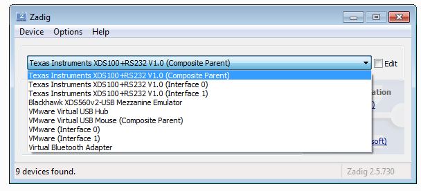

---
date: July 29, 2021
...

# QtOscillo (GUI Version of OscilloDSP) User Manual (Version 1.1)

## Table of Contents

* [Introduction](#introduction)
* [Installation as a Python Application](#installation-as-a-python-application)
   * [Installing the FTDI Driver (Optional)](#installing-the-ftdi-driver-optional)
   * [Installing Python](#installing-python)
   * [Removing Libraries (Optional)](#removing-libraries-optional)
   * [Installing the Required Python Libraries](#installing-the-required-python-libraries)
* [Usage](#usage)
   * [DSP-Side Settings](#dsp-side-settings)
   * [Starting the Application](#starting-the-application)
   * [Setting the Communication Interface](#setting-the-communication-interface)
   * [Running the Oscilloscope](#running-the-oscilloscope)
   * [Explanation of the Control Panel](#explanation-of-the-control-panel)
   * [Explanation of the Menus](#explanation-of-the-menus)
* [How to Generate a Windows Application Using PyInstaller](#how-to-generate-a-windows-application-using-pyinstaller)

## Introduction

QtOscillo is a GUI software designed to use OscilloDSP (a virtual oscilloscope) without the need for Jupyter Notebook.

## Installation as a Python Application

This section explains how to install QtOscillo on 64-bit Windows.

### Installing the FTDI Driver (Optional)

If you want to communicate with the target processor (such as a TI DSP evaluation board) via an FTDI chip for high-speed communication, you need to install the FTDI chip driver.

This is optional, and you can also connect via COM port at speeds like 115.2kbps without the driver.

To easily switch USB drivers, use the [Zadig](https://zadig.akeo.ie/) tool. Download and run the tool from the website (version 2.5 was used for this guide).


Connect the USB connector on the main body of the C6678 EVM board (not the mezzanine emulator) to the computer. Make sure to set the header pins so that the DSP UART is connected to FT2232H (this is the factory default setting).

Next, power on the EVM board. Follow the instructions on the PyFtdi website:

1. From the menu, check Options → List All Devices.
2. Uncheck Options → Ignore Hubs or Composite Parents.
3. From the dropdown menu, select “Texas Instruments XDS100+RS232 V1.0 (Composite Parent)”.



4. On the right side where it says "Driver", you will see the current and desired drivers displayed next to the red arrow. Select `libusb-win32` as the desired driver (you can choose it using the small triangle buttons).
5. Click the "Replace Driver" button.
6. Wait for a few seconds (there may be no response for a while).
7. When you see a "Warning - System Driver" message, click "Yes" to install the driver.
8. Exit Zadig.
9. Open the Device Manager from the Control Panel and verify that the device is correctly set under the `libusb-win32 devices` tree.

### Installing Python

> **Note**: If you have other versions of Python installed, please uninstall them first.
> For this reason, it is safer to prepare a dedicated PC for OscilloDSP. However, if you're interested, [pyenv for Windows](https://github.com/pyenv-win/pyenv-win) might be useful, as it allows you to install and switch between multiple versions of Python on a single PC.

Download Python from the [official website](https://www.python.org/downloads/windows/). For this guide, we used Python 3.8.5 Windows x86-64 executable installer. Although newer versions might work, we used the same version as the previous release for consistency.

During installation, check the "Add Python 3.8 to PATH" option and click "Install Now."


### Removing Libraries (Optional)

Removing libraries is optional, but we recommend doing so if you want to ensure proper functionality. Please note that removing libraries may affect other Python users on the system, so proceed carefully.

**How to remove libraries**:
```
Z:\yokoyama> python -m pip freeze >> erase.txt
Z:\yokoyama> python -m pip uninstall -r erase.txt -y
```

If you see the error `ERROR: You must give at least one requirement to uninstall (see "pip help uninstall")`, you can ignore it.

Next, run the following command. If nothing is displayed, the libraries have been successfully removed:
```
Z:\yokoyama> python -m pip freeze
```

If something is still displayed, try running the library removal commands again.

### Installing the Required Python Libraries

First, extract the OscilloDSP package provided to you (e.g., `oscillodsp_*.zip`).

Open `cmd.exe` (the command prompt) and navigate to the top-level `oscillodsp` directory (not the `hostapp/oscillodsp` directory):

```
oscillodsp
|-- hostapp
|   |-- oscillodsp
|   `-- tests
|-- pcsim
|-- protobuf
|-- tools
`-- workspace
    `-- oscillodemo
```

Install the necessary libraries as follows:

**Note**: We are not installing Jupyter-related libraries this time. If you want to install them, change `requirements_wo_jupyter.txt` to `requirements.txt` in the command below. However, this is not recommended, as unnecessary libraries might be included when generating the executable file using PyInstaller later.

```
Z:\yokoyama\oscillodsp> python -m pip install -U --user -r hostapp\requirements_wo_jupyter.txt
```

After a few minutes, the installation will complete, as shown below:

```
Z:\yokoyama\oscillodsp> python -m pip install -U --user -r hostapp\requirements_wo_jupyter.txt
Collecting matplotlib==3.1.3
  Downloading matplotlib-3.1.3-cp38-cp38-win_amd64.whl (9.1 MB)
     |████████████████████████████████| 9.1 MB 2.2 MB/s
Collecting pyftdi==0.51.2
  Downloading pyftdi-0.51.2-py3-none-any.whl (150 kB)
     |████████████████████████████████| 150 kB 6.8 MB/s
Collecting pyserial==3.4
  Downloading pyserial-3.4-py2.py3-none-any.whl (193 kB)
     |████████████████████████████████| 193 kB 6.4 MB/s
Collecting protobuf==3.12.2
  Downloading protobuf-3.12.2-py2.py3-none-any.whl (443 kB)
     |████████████████████████████████| 443 kB 6.8 MB/s
Collecting grpcio-tools==1.30.0
  Downloading grpcio_tools-1.30.0-cp38-cp38-win_amd64.whl (1.6 MB)
     |████████████████████████████████| 1.6 MB 3.3 MB/s
（略）
```

You may see some warnings, but they are generally safe to ignore.

## Usage

### DSP-Side Settings

Since this overlaps with previous explanations, it is omitted here. Please refer to [How to Use OscilloDSP](./usage.ipynb) for more details.

### Starting the Application

Execute the following commands:

```
Z:\yokoyama\oscillodsp> cd hostapp
Z:\yokoyama\oscillodsp\hostapp> python qtoscillo.py
```

You will see the following screen.
(If it doesn't open properly, feel free to contact us, and please attach a screenshot if possible.)


### Setting the Communication Interface

The communication interface settings dialog will automatically open when you first start the application. If it doesn’t, select Settings → Interface... from the menu.


If using an FTDI interface, select the appropriate interface (e.g., `ftdi://ftdi:0xa6d0:TIU72PWC/2`).

For Baud rate (bps), enter an appropriate communication speed, such as 2000000.

Finally, click the OK button.

### Running the Oscilloscope

After verifying that the DSP is running, click the "Run" button on the screen. If a screen like the one below appears, the oscilloscope is running correctly.


### Explanation of the Control Panel

Please also refer to the previous Jupyter app version’s [manual](./usage.ipynb).

- **Active Channel**: Changes the vertical axis display on the left side of the oscilloscope to the selected channel. The Scale and Pos sliders are also effective for the selected channel in Active Channel.
- **Trigger Channel**: Selects the channel for triggering.
- **

Trigger Type**: Selects the trigger type (Rising Edge, Falling Edge).
- **Trigger Mode**: Selects the trigger mode. Three modes are available:
  - Auto: Automatic mode (when triggered, the display follows the trigger; otherwise, it continuously shows the latest data).
  - Normal: Normal mode (when not triggered, the screen update stops, and no data is sent from the DSP).
  - Single: Single-shot mode (the screen update stops when triggered. Pressing the Reset button will make it wait for another trigger).
- **Reset** button: Resets the trigger when in Single mode, making the system wait for the next trigger.
- **Trigger Level**: Sets the trigger level, with units in physical quantities (volts, amperes, etc.).
- **Horizontal Scale**: Adjusts the time axis scale.
- **Scale**, **Pos**: Adjusts the vertical axis scale and position for the channel selected in Active Channel.
- **Run** or **Stop**: Starts or stops the oscilloscope.
- **Save as Image File**: Saves the waveform as a PNG image file.
- **Save as CSV File**: Saves the raw data of the displayed waveform as a CSV file.
- **Channel Display Toggle Buttons**: These are buttons displayed at the bottom of the screen. Clicking a button hides the corresponding channel, and clicking again re-displays it.

### Explanation of the Menus

#### File Menu

- **Quit QtOscillo**: Exits the application. You can also exit by clicking the close button of the application window. If there are unsaved settings (mentioned later in Settings), a confirmation dialog will appear, allowing you to save them if necessary.

#### Settings Menu

- **New**: Resets the settings to their initial state. This will display a dialog to reselect the communication interface.
- **Load...**: Loads saved settings. The name of the settings file will be displayed at the top of the window.
- **Save**, **Save As...**: Saves the settings to a file.
- **Interface...**: Specifies the communication interface and speed. An error will occur if an unsupported speed is set for the selected interface.
- **Channel Colors...**: Changes the display color of the waveform for each channel. Click the button displaying the channel number, select a color, and click OK.

#### Logging Menu

- **View log...**: Opens a window to display system logs.
Unchecking the Autoscroll button will stop automatic scrolling.
In Application Log Level, you can set the log display level for the oscilloscope application. By default, it is set to Disabled.
DSP Driver Log Level sets the log display level for the DSP driver (the Python library that controls communication with the DSP). By default, it is also set to Disabled.
These log level settings are not saved to the settings file by default (to avoid filling up disk space with excessive logs). However, if you check the Set the Log Levels as the default checkbox, they will be saved when you use Save or Save As... from the Settings menu.
(Note: You must explicitly save the settings after checking this box.)

## How to Generate a Windows Application Using PyInstaller

First, install PyInstaller. The following command installs the latest version of PyInstaller:

```
Z:\yokoyama\oscillodsp> python -m pip install -U --user pyinstaller
```

If you want to use a verified version, you can specify version 4.3 as follows:

```
Z:\yokoyama\oscillodsp> python -m pip install -U --user pyinstaller==4.3
```

Next, generate the Windows application (an executable file in `.exe` format):

```
Z:\yokoyama\oscillodsp> python -m PyInstaller qtoscillo.spec
```

A `dist\qtoscillo\qtoscillo.exe` file will be generated in a subdirectory. You can run it from `cmd.exe`, or by double-clicking it in the File Explorer. You may want to create a shortcut on your desktop for easier access.

If the executable generated by PyInstaller does not work properly, open the `qtoscillo.spec` file in a text editor and modify the following:

```
debug=False,
...
console=False)
```

Change these lines to:

```
debug=True,
...
console=True)
```

Then, run PyInstaller again.

Afterward, run the application from `cmd.exe` as follows:

```
Z:\yokoyama\oscillodsp> dist\qtoscillo\qtoscillo.exe
```

If you see any error messages in the `cmd.exe` window, please copy them and send them to us. We will check them for you.

Feel free to contact us if you have any questions. You can reach us at [contact@flogics.com](mailto:contact@flogics.com).

[End of Document]
