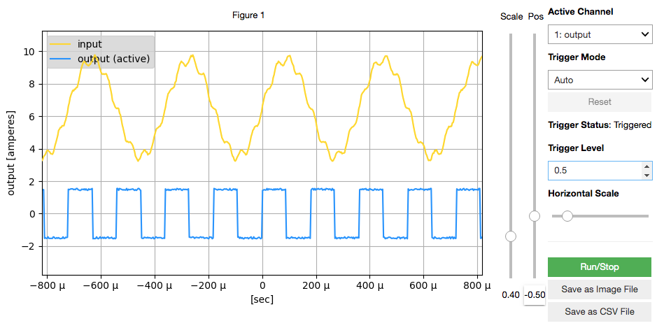

# How to Use OscilloDSP

- ***At the end, there is a section for [FAQ and Troubleshooting](#FAQ-and-Troubleshooting).***

## Overview

OscilloDSP is a tool that sends sensor values, computed data, etc., from programs running on embedded processors like DSPs to a PC, where a Python program visualizes them like an oscilloscope.



The data is transmitted from the embedded processor to the PC via communication interfaces like UART.

To reduce the amount of communication data, which would otherwise become massive if all real-time measurement data were sent to the PC, OscilloDSP only sends the information necessary for visualization. (In experiments, the transmission rate is about 100kbps for 2-channel data.)

Communication data between the embedded processor and the PC is systematically encoded and decoded using a mechanism called Google [Protocol Buffers](https://developers.google.com/protocol-buffers).

## PC Simulation

Even if you don't have a DSP board on hand, you can verify the operation of OscilloDSP using the provided [PC simulator](../pcsim).
This simulator is written for POSIX (UNIX), so it works on Linux and Mac OS.
Unfortunately, due to differences in the communication mechanism, it may not work on Windows as-is.

When running with the PC simulator, refer to the functions `oscillo_get_demo1_value()` and `oscillo_get_demo2_value()` in the [main.c](../pcsim/main.c) and [oscillo.c](../pcsim/oscillo.c) files of the PC simulator.
Also, during execution of [oscillo_en.ipynb](oscillo_en.ipynb), set `USE_PCSIM` to `True` in the cell titled [Loading OscilloDSP Module and Defining Constants](oscillo_en.ipynb#OscilloDSP-Module-Loading-and-Defining-Constants). Running the `oscillo.run_pcsim()` function will automatically build and run the `pcsim`.

## DSP or pcsim Program Side

A sample project for DSP is available [here](../workspace/oscillodemo).
The usage is the same for both oscillodemo and pcsim, but here we provide a sample program for DSP.

### Main Routine

The main routine for TI DSP initializes the UART peripheral.
In the following example, UART0 is set to 2083333 bps.
This speed has been verified to work on the C6678 EVM. (The opposing PC is set to 2000000 bps. Although there is a slight discrepancy, it works in the author's environment.)

Afterward, the DSP RTOS (SYS/BIOS) scheduler is called with `BIOS_start()`.

```c
void main(void)
{
    init_cic_interrupt(UART0_INTNUM, UART0_CIC, CIC0_UART0INT_EV, CIC_OUT_CH);
    uart_init(UART0, uart_readbuf, uart_writebuf, UART_READBUF_LEN,
        UART_WRITEBUF_LEN, 2083333, 16, UART0_INTNUM);
    BIOS_start();
}
```

### OscilloDSP Initialization

The following code in the task function `func_task_main()` is the initial setup part of the OscilloDSP library.

```c
    oscillo_init(1e6, 1e-3);

    ch0 = oscillo_config_ch("input", "volts", -4.0, 5.0);
    ch1 = oscillo_config_ch("output", "amperes", -3.0, 3.0);
```

The first argument of the `oscillo_init()` function is the sampling rate (Hz), and the next argument is the initial time width (seconds) of the scope when the oscilloscope screen is displayed on the PC.
Here, the sampling rate is set to 1MHz, and the scope width is set to 1 millisecond.

The reason for specifying the sampling rate is that, when passing sample values to the OscilloDSP library in later code, you need to know how much time has passed between function calls in order to display the time axis on the oscilloscope screen.

> **Note**
>
> For example, if you set the sampling rate to 1MHz, you should pass 1 million (1M) samples to the `oscillo_pass_one()` function within 1 second of real-time.
> (A slight difference is acceptable and will not affect the visibility or functionality.)
> 
> On the other hand, if the sampling rate is set to 1MHz but only 100,000 samples arrive within 1 second of real-time, OscilloDSP will assume that only 0.1 seconds of real-time has passed.

> **Design Reason**
>
> As for why real-time processing is not handled within oscillo.c, it is because, when passing actual data to oscillo.c, the system providing the data likely has its own real-time clock source (e.g., an external clock).
> Therefore, referring to real-time information separately (such as using the DSP SYS/BIOS tick) could cause clock synchronization issues, complicating matters.
> As a result, oscillo.c assumes no contradiction between the sampling rate specified in `oscillo_init()` and the number of samples passed to `oscillo_pass_one()`.

In the above example, two oscilloscope channels are initialized.
The first channel `ch0` is named “input” (you can specify any name using alphanumeric characters) and the unit is set to “volts.”
Although the unit could be simply “V,” it is displayed horizontally on the screen, so “volts” is used here for clarity.

The next arguments are the minimum and maximum values for **this channel's** sample values.
Note that values outside this range will be clipped, so you need to set this range with some margin.
However, if the range is set too wide, the resolution of the data sent to the PC will decrease (the number of bits used for quantization will be reduced), so it's better not to set it too wide.

The last line sets up channel 1. Here, the channel is named “output” and the unit is set to amperes.
Of course, you can specify any name and unit you like.

> **TIPS**
> 
> Internally, OscilloDSP temporarily stores the passed sample values as float, but converts them to fixed-point values when sending them to the PC.
> The fixed-point values are quantized to the number of bits specified by the `quantize_bits` argument when calling `oscillo.Oscillo()` in the Python code.
> 
> Suitable values for `quantize_bits` are typically 8 or 16. The former reduces data size and improves performance, while the latter slightly increases communication data.
> When displaying the graph on the PC screen, differences in 2^16 steps are not visually discernible, so `quantize_bits = 8` is generally sufficient.
> However, if you need a higher quantization bit depth (such as for saving data to a CSV file), you can set it to 16.
>
> If you need a quantization bit depth greater than 16 (though this is unlikely), you will need to modify the DSP program or pcsim's [config.h](../pcsim/config.h), where `typedef short buffer_t;` should be changed from short to a larger integer type.

### Passing Sample Values

You can pass sensor or computed values using the following code.

`ch0` is the value returned by `oscillo_config_ch()`, and this is used to identify the channel.
The second argument is of type float and provides the sensor or computed value.

```c
        oscillo_pass_one(ch0, oscillo_get_demo1_value(active));
        oscillo_pass_one(ch1, oscillo_get_demo2_value(true));
```

`oscillo_get_demo1_value()` and `oscillo_get_demo2_value()` are demo sample value calculation functions defined in [oscillo.c](../pcsim/oscillo.c).
The former returns the following:

$$0.5 + 3\sin(2\pi ft) + 0.3\sin(2\pi ft) + \text{Noise (}f \approx 2800 \text{Hz)}$$

The latter returns a square wave with an amplitude of 1.5 (with noise).

Both are good references if you look inside the functions.

> The `active` variable is used to periodically (every 4 seconds) start and stop the waveform output.
> It was prepared to test the trigger function.

### Communication with the PC

Before the code that passes sample values to the library, there is the following code:

```c
        com_proc();
```

This function checks whether there is a message (command) from the PC via UART, and if there is, processes the message.
If there is an instruction from the Python code on the PC to pass waveform data, the data will be sent to the PC.

You don't need to call this function very frequently, but if you want to redraw more than 3 times per second, you need to call this function at least that frequently.
This function does not block. If there is no necessary processing (no message from the PC), it will return immediately.

Note that the OscilloDSP library is not designed to be [thread-safe](https://en.wikipedia.org/wiki/Thread_safety), so you cannot call `oscillo_pass_one()` and `com_proc()` from different tasks in the RTOS (SYS/BIOS).
(Operation is not guaranteed.)
If you need it to be thread-safe, please implement wrapper functions, although this is probably not necessary in most cases.


## PC Program

For the oscilloscope visualization on the PC, Python programs are used.
Rather than running Python from the command line, [Jupyter Notebook](https://jupyter.org/) and the following tools are used:

- [Matplotlib](https://matplotlib.org/)
- [ipywidgets](https://ipywidgets.readthedocs.io/)
- [ipympl](https://github.com/matplotlib/ipympl)

Here's a brief explanation of each.

### Jupyter Notebook

A tool that allows you to gather documents and program code in one place on a web browser (like this guide), and run the program on your PC or a server on the internet to create dynamic reports.

### Matplotlib

A library for plotting mathematical or technical graphs in Python.
It can be used even without Jupyter Notebook.

### ipywidgets

A library that links graphical user interface (GUI) components with Python programs in Jupyter Notebook.

### ipympl

A library that integrates ipywidgets with Matplotlib.

## Actual Usage

### Initial Setup

As previously mentioned, if you're using the PC simulator (pcsim), set `USE_PCSIM` to `True`.
In that case, no other setup is required.

> When using pcsim, set `UART_BITRATE` to a typical serial communication speed of 115200 bps or lower.

If you want to communicate with embedded processors like DSPs, connect the DSP board to the PC via UART beforehand.
It is recommended to use a USB-UART bridge interface, such as FTDI's FT232R or FT2232H.
Depending on the capabilities of the embedded processor, this allows high-speed communication at around 2Mbps.

When using a regular serial interface, specify `UART_DEVICE` as `COM1` or `/dev/ttyUSB0`, etc., depending on the OS.

If you are using FTDI's USB-UART bridge, follow the [installation guide](https://eblot.github.io/pyftdi/installation.html) for [PyFtdi](https://github.com/eblot/pyftdi) and install it.

> Refer to [installation_en.ipynb](installation_en.ipynb) as well.

Then specify the device name for `UART_DEVICE` as something like `ftdi://ftdi:232:FTGYDM6A/1` (specific to PyFtdi).
If you're not sure what device name to use, try specifying `ftdi:` (don't forget the colon).
When you run the code below the “Setup Oscilloscope” section, the available device names in your environment will be displayed at the bottom of the oscilloscope screen.
If you are using the FT2232H on a TI C6657 EVM or C6678 EVM board, select the second of the two displayed device names.
(The first one is connected to the JTAG emulator on the board.)

Start the embedded processor program before running the Python code.

Then execute the cells in [oscillo_en.ipynb](oscillo_en.ipynb) one by one from the top.
When you run the code below the “Start Oscilloscope” section, the oscilloscope will start running.

### Oscilloscope Operation

Waveforms are displayed on the left side of the oscilloscope screen.
If there are multiple channels, each channel is displayed in a different color:

- Channel 0: Yellow
- Channel 1: Cyan
- Channel 2: Pink
- Channel 3: Dark Blue
- Others: Black (modifiable by editing the program code)

(These colors were matched to those of the Rigol oscilloscope I own.)

The following explains how to use the pull-down menus, sliders (knobs), and buttons on the right side of the screen.

#### Active Channel

As previously mentioned, `oscillo_config_ch()` on the DSP side allows setting physical units and value ranges for each channel individually.
As a result, the vertical axis of the oscilloscope may differ for each channel.
By selecting a channel in Active Channel, you can switch the vertical axis display.
For example, if the unit for channel 0 is volts, selecting 0 in Active Channel will display the correct vertical axis.

#### Trigger Mode

You can select from three modes, which are similar to a regular oscilloscope:

- **Auto**: Automatic mode (When the trigger is active, the display follows the trigger. When the trigger is not active, the latest data is always displayed.)
- **Normal**: Normal mode (When the trigger is not active, the screen update stops, and the DSP does not send data.)
- **Single**: Single (one-shot) mode (When the trigger is active, the screen update stops. Pressing the “Reset” button will make it wait for another trigger.)

> **Student Exercise**
> 
> Currently, the channel used for the trigger is fixed to channel 0.
> You can add functionality by modifying the Python code in [oscillo.py](oscillodsp/oscillo.py).
>
> Also, the trigger type is currently fixed to the rising edge.
> By making minor modifications to the Python and DSP code, you can make it work with the falling edge.

#### Trigger Status

This shows the current trigger status. If the status is blinking, it means the trigger is not active.

#### Trigger Level

This sets the trigger level, with units in physical quantities (volts or amperes). You can step-adjust the level with the arrow buttons on the right of the window or directly input values into the window (the latter is more general).

#### Horizontal Scale

This adjusts the time scale.
Moving it to the right will zoom in, but setting it higher than the sampling rate is meaningless.
(Example: If the sampling rate is 1MHz, setting the scale to 1 microsecond will display only one sample on the screen.)

Moving it to the left will zoom out, but you cannot set it larger than the size of the ring buffer `buffer[]` in DSP, defined by `LEN_BUFFER`.
For example, if the sampling rate is 1MHz and `LEN_BUFFER` is 16384, only 16.384 milliseconds of samples can be stored in the buffer, so you cannot zoom out (move the slider to the left) beyond that.

#### Scale, Pos

The two sliders on the right side of the oscilloscope are Scale and Pos.
Use these to adjust the vertical scale and offset of the current Active Channel.
The position of the round knob on the Pos slider corresponds to the zero axis of the physical quantity. For example, if the physical unit of the channel is volts, placing the knob about one-third from the bottom of the screen will set that point to zero volts.

If you regularly use real oscilloscopes, you can adjust the display so that the waveforms of multiple channels do not overlap (refer to the screen example at the beginning of this page).
For those who don't, it might be easier to display zero volts in the center of the screen, especially if both channels measure the same physical quantity (e.g., volts).
(However, if the minimum and maximum values set by `oscillo_config_ch()` differ for each channel, make sure to check the vertical axis after selecting the channel in Active Channel to avoid misreading the values.)

#### Run/Stop

You can stop and resume the oscilloscope.
However, while stopped, the program is paused, and GUI settings will not work.

#### Save as Image File

This saves the currently displayed waveform as a PNG file.
It will be saved in the [hostapp directory](.).

> **Note**
>
> For this project, we used Matplotlib version 3.1.3, but in newer versions of Matplotlib, saving the screen while the oscilloscope is running may not work.
> If you must use a newer version than 3.1.3, try stopping the oscilloscope using the Run/Stop button before saving the image. (However, details are unconfirmed.)

#### Save as CSV File

Similarly, this saves the waveform as a CSV file.

## How to Change Various Constant Values

By changing constants in the program, you can modify restrictions during operation.

### Maximum Number of Channels

By default, it is set to 2. You can change this by modifying both values in the [protobuf/oscillodsp.options](protobuf/oscillodsp.options) file:

```
ConfigReply.chconfig            max_count: 2
WaveGroup.wave                  max_count: 2
```

If you modify this Protocol Buffers definition file, you will need to update (rebuild) the following files by running the `make` command in the `protobuf` directory:

- [hostapp/oscillodsp/oscillodsp_pb2.py](oscillodsp/oscillodsp_pb2.py)
- [pcsim/oscillodsp.pb.c](../pcsim/oscillodsp.pb.c)
- [pcsim/oscillodsp.pb.h](../pcsim/oscillodsp.pb.h)
- [workspace/oscillodemo/oscillodsp.pb.c](../workspace/oscillodemo/oscillodsp.pb.c)
- [workspace/oscillodemo/oscillodsp.pb.h](../workspace/oscillodemo/oscillodsp.pb.h)

### Number of Waveform Samples

The default number of waveform samples sent from the DSP to the PC at one time is set to 500.
This should be sufficient for visualization, but if you want to increase it to 1000, you can do so by changing the value in the [protobuf/oscillodsp.options](protobuf/oscillodsp.options) file:

```
Wave.samples                    max_count: 500
```

Change this to 1000 to double the data transmission. In this case, you will also need to update the generated files as mentioned above.

### Buffer Size in DSP

The values passed to the `oscillo_pass_one()` function in the DSP program are stored in the ring buffer `buffer[][]` before being transmitted to the PC.
The buffer size is set to 16384 samples by default, but if you want to change it, modify the value in the `config.h` file of the pcsim or DSP demo code:

```c
enum oscillo {
    LEN_BUFFER = 16384,
};
```

Increasing this value will allow you to move the Horizontal Scale slider further to the left, enabling a wider view of past sample values.

### Quantization Bit Depth for Samples Sent to the PC

Refer to the TIPS in the section [OscilloDSP Initialization](#OscilloDSP-Initialization).

## FAQ and Troubleshooting

### The oscilloscope screen appears, but nothing happens beyond that

If the Python program on the PC and the DSP are not correctly synchronized, the oscilloscope may not function properly.
Please try the following steps carefully.

> If it still doesn't work, try lowering the UART communication speed (default is 2Mbps) to around 115.2kbps to isolate the issue.
> You'll need to change the communication speed on both the DSP and the PC.
> For the former, refer to [Main Routine](#Main-Routine) and change the 6th argument of `uart_init()`.
> For the latter, change the number in `UART_BITRATE = 2000000` in [oscillo_en.ipynb](./oscillo_en.ipynb).

#### Steps

1. In the Jupyter menu of the Jupyter app ([oscillo_en.ipynb](./oscillo_en.ipynb)) on the PC, run Kernel → Restart & Clear Output to completely stop the “Python kernel.”

2. Turn on the DSP board. (If it's already powered on, perform a system reset using the steps below.)

3. In CCS, connect the emulator to the target using the Target Configurations menu or similar.

4. To fully initialize the UART circuit of the DSP, perform a system reset on the DSP side. There are three ways to do this (recommended is ***C***).

   A. Turn off the DSP board and turn it back on.
   
   B. Press the reset button on the DSP board.
   
   C. In the CCS menu, go to Run → Reset → System Reset, then Run → Disconnect, and finally Run → Connect Target.

5. Load the DSP program.

6. Refer to the document [ccs_build_en.ipynb](./ccs_build_en.ipynb) and set 4 breakpoints in uart.c. Once a breakpoint is hit (fatal error), it won't affect real-time execution.

7. Resume the DSP by going to Run → Resume.

8. Execute the cells in Jupyter from top to bottom.
