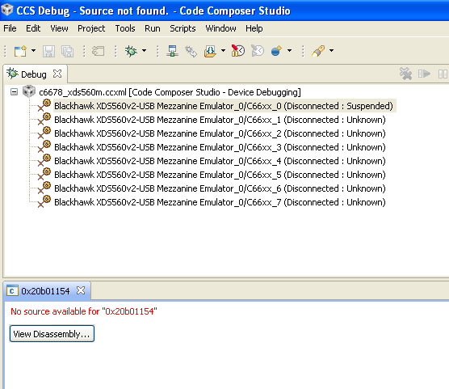

# How to Run the Demo App with TI Code Composer Studio

Here, we use Code Composer Studio (CCS) version 5.5.0.
Although it is possible to migrate the CCS project to a newer version, TI C66x works without issues on CCS 5.5.0.
Note that CCS 5.5.0 is not supported on newer operating systems like Windows 10, but installation and execution proceed without major problems.
(However, TI likely does not guarantee its operation.)

**Currently, only a project for the TI C6678 EVM is available. It will not work on other DSPs like the C6657 without modification.**

## Launch CCS and Build the Demo Program

Launch CCS and specify the workspace.

In the menu, go to File → Switch Workspace, select the workspace directory under oscillodsp, and press OK.


Next, from the menu, select File → Import....
When the dialog opens, expand the Code Composer Studio tree, select Existing CCS Eclipse Projects, and press Next >.

A dialog like the one below will open. Press the Browse... button next to Select search-directory.


Then, select the oscillodemo directory under the workspace directory and press OK.
Back in the original dialog, confirm the following and press Finish:

- Ensure that oscidemo is checked under Discovered projects.
- Ensure that Copy project into workspace is **unchecked**.

The oscillodemo project will appear in Project Explorer. Double-click ```main.c``` under it to open the file.


As you can see in the file, the UART pre-divider is set to 16, and the bitrate is set to 2083333 bps.
Modify these settings as necessary.

Next, right-click the oscillodemo project in Project Explorer and select Build Project.
The first build may take some time, but within a few minutes, the binary file ```Debug\oscillodsp.out``` should be generated.

Connect the EVM's connector (in this case, using the XDS mezzanine emulator) to the PC with a USB cable and power on the EVM.
In CCS, go to File → Target Configurations, select the configuration for the C6678 EVM, and choose Launch Selected Configuration.

When the following screen appears, select core #0 for this time, and from the menu, choose Run → Connect Target.



Next, from the menu, select Run → Load Program.
In the dialog that appears, select the file such as ```C:\oscillodsp\workspace\oscillodemo\Debug\oscillodemo.out``` and press OK.

## Setting Breakpoints

Errors may occur when the DSP communicates with the PC via UART, so set some breakpoints to detect when errors occur.

> The current communication library in the OscilloDSP library does not have error detection or retransmission functionality, so even a single-bit communication error can cause abnormal behavior.
> If you experience communication errors, try lowering the communication speed (bitrate).

The line numbers on the left are approximate. (They may change with future releases.)
In CCS, open uart.c, and double-click the line numbers in the CCS interface to set breakpoints.

```
129:             p->n_errors ++;
140:                 p->rx_overrun ++;
146:             p->n_errors ++;
228:             p->tx_overrun ++;
```

Finally, go to Run → Resume to start the program.
