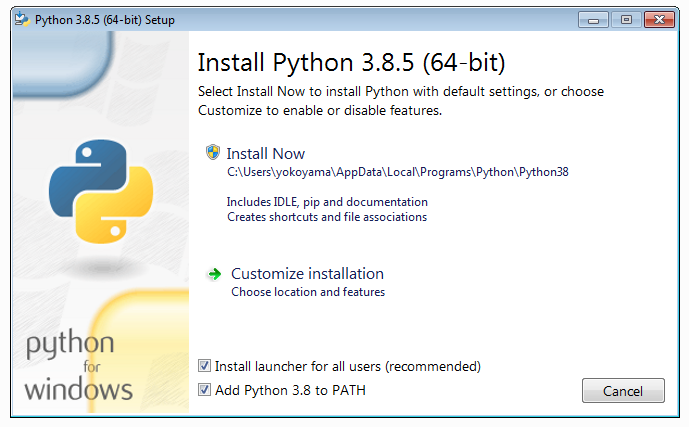
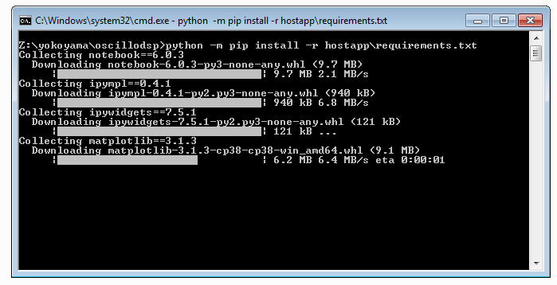
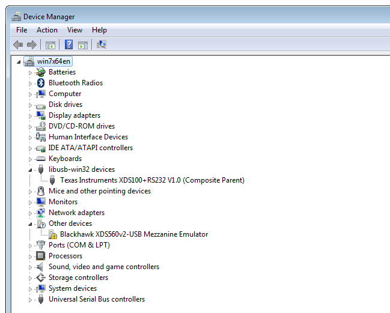

# Installation Guide (Windows Edition)

This section explains how to install the entire environment on a Windows OS.

## Installing Python

OscilloDSP will **likely** work with Python versions 3.7 or later, but in this guide, we will install the stable version 3.8.5.

Download Python from [this website](https://www.python.org/downloads/windows/). In this example, we will use the Python 3.8.5 Windows x86-64 executable installer.
During the installation, check **“Add Python 3.8 to PATH”**, and then click Install Now.
After the installation is complete, **log off and log back into Windows** to apply the PATH settings.



## Installing Required Python Libraries

First, extract the OscilloDSP package (e.g., oscillodsp_*.zip) provided.

Open cmd.exe in Windows to launch the DOS window.
The extracted package will have the following directory structure, so navigate to the oscillodsp directory using the cd command.

```
oscillodsp/
├── hostapp
│   └── oscillodsp
├── pcsim
├── protobuf
├── tools
└── workspace
    └── oscillodemo
```


> **Note**
>
> Running the following commands may overwrite Python libraries that are already installed.
>
> Also, since libraries like Matplotlib and Ipywidgets are frequently updated, different versions may cause different behavior. Therefore, please use the versions specified in [requirements.txt](requirements.txt) as much as possible.
>
> If you have confirmed that newer versions of the libraries work, we would appreciate it if you could notify the author (contact@flogics.com).

Next, run the following command.
(In the following examples, we use ```Z:\yokoyama\oscillodsp>``` as the cmd.exe prompt.)

```
Z:\yokoyama\oscillodsp> python -m pip install -r hostapp\requirements.txt
```

The installation will be completed in a few minutes, and the screen will look like this:



## Setting up PyFtdi

PyFtdi will not work as-is, so follow the setup instructions on the [PyFtdi website](https://eblot.github.io/pyftdi/installation.html).

To easily switch USB drivers, use a tool called [Zadig](https://zadig.akeo.ie/).
Download and run the tool from the website.
(For this guide, version 2.5 was used.)


In this case, we connect the USB connector on the **main board** of the C6678 EVM board (not the mezzanine emulator) to the PC and use the FTDI FT2232H on the board.
Make sure to set the header pins so that the DSP's UART connects to the FT2232H. (This is the factory default setting.)

Follow the instructions on the PyFtdi site:

1. From the menu, check Options → List All Devices.
2. Uncheck Options → Ignore Hubs or Composite Parents.
3. Select “Texas Instruments XDS100+RS232 V1.0 (Composite Parent)” from the drop-down menu.


4. On the right of the Driver section, between the red arrows, you will see the “current driver” and the “driver to install.”
Select libusb-win32 as the driver to install. (You can select it using the small up/down triangles.)
5. Click the Replace Driver button.
6. There will be no response for a few seconds, but wait for about 30 seconds.
7. A warning called “Warning - System Driver” will appear; click Yes to install.
8. Exit Zadig.
9. Open the Device Manager from the Control Panel and check under the libusb-win32 devices tree to verify the correct settings.



## Installing Protocol Buffers Compiler and Nanopb

OscilloDSP uses a mechanism called Google [Protocol Buffers](https://developers.google.com/protocol-buffers) to communicate between the PC and DSP.
In Protocol Buffers (hereinafter, protobuf), you write a protocol specification file (*.proto) and pass it to the protobuf compiler, which automatically generates source code and header files for use in C or Python.
Additionally, we use a special protobuf compiler called [Nanopb](https://github.com/nanopb/nanopb), designed for embedded processors with a compact design.

The OscilloDSP package includes pre-generated files (listed below), so if you do not modify the *.proto files (or *.options files), you do not need to install the protobuf compiler or Nanopb, but it is recommended.

- hostapp/oscillodsp/oscillodsp_pb2.py
- pcsim/oscillodsp.pb.c
- pcsim/oscillodsp.pb.h
- workspace/oscillodemo/oscillodsp.pb.c
- workspace/oscillodemo/oscillodsp.pb.h

First, install the original Google protobuf compiler.
Download protoc-3.12.4-win64.zip from [this website](https://github.com/protocolbuffers/protobuf/releases) and extract it to the root of the oscillodsp directory.
Rename the directory to ```protobufc```. Make sure to add the 'c' at the end.
Check that the directory structure looks like this (note the locations of bin and include):

```
oscillodsp/
├── hostapp
├── pcsim
├── protobuf
├── protobufc
│   ├── bin
│   └── include
```

Next, download Nanopb from [here](https://github.com/nanopb/nanopb/releases/tag/0.4.2).
The zip format is convenient.
Extract this file and rename the directory to form the following structure (some directories and files are omitted):

```
oscillodsp/
├── hostapp
├── nanopb
│   ├── SwiftPackage
│   ├── conan-wrapper
│   ├── docs
│   ├── examples
│   ├── extra
│   ├── generator
│   ├── spm-test
│   ├── tests
│   └── tools
├── pcsim
├── protobuf
├── protobufc
```

### Testing Protobuf Compiler and Nanopb

Now, let's test the protobuf compiler and Nanopb.
(You can skip this if you are using the files provided in the OscilloDSP package.)

First, delete the following files (included in the OscilloDSP package):

- hostapp/oscillodsp/oscillodsp_pb2.py
- pcsim/oscillodsp.pb.c
- pcsim/oscillodsp.pb.h
- workspace/oscillodemo/oscillodsp.pb.c
- workspace/oscillodemo/oscillodsp.pb.h

Then, run the following commands (don't forget the ```..\``` after the prompt):

> You may encounter an error like ```ModuleNotFoundError: No module named 'proto.nanopb_pb2'```.
> In that case, please try running it again.

```
Z:\yokoyama\oscillodsp> cd protobuf
Z:\yokoyama\oscillodsp\protobuf> ..\nanopb\generator\protoc --nanopb_out=..\workspace\oscillodemo oscillodsp.proto
Z:\yokoyama\oscillodsp\protobuf> ..\nanopb\generator\protoc --nanopb_out=..\pcsim oscillodsp.proto
Z:\yokoyama\oscillodsp\protobuf> ..\protobufc\bin\protoc --python_out=..\hostapp\oscillodsp oscillodsp.proto
```

The directories specified with ```--nanopb_out``` and ```--python_out``` are the output destinations.
Check that the following files are generated:

- hostapp/oscillodsp/oscillodsp_pb2.py
- pcsim/oscillodsp.pb.c
- pcsim/oscillodsp.pb.h
- workspace/oscillodemo/oscillodsp.pb.c
- workspace/oscillodemo/oscillodsp.pb.h

## Installing a Web Browser

Jupyter Notebook runs through a web browser, but it may not function correctly with older browsers.
Please install the latest version of a browser like Google Chrome or Firefox.

## Testing Jupyter Notebook

Finally, let's explain how to start Jupyter Notebook.

First, navigate back to the oscillodsp directory using cd.
Then, start Jupyter Notebook.

```
Z:\yokoyama\oscillodsp\protobuf> cd ..
Z:\yokoyama\oscillodsp> python -m notebook
```


If a screen like the one above opens in your web browser (here, Google Chrome), but it does not, copy the URL shown in cmd.exe, such as:

```
http://127.0.0.1:8888/?token=a6348c9e077980cf761957188c9ebe582b7c3d89d0888d0f
```

Paste it into your browser. Please note that the token (hexadecimal string) will be different each time you start Jupyter.

Once Jupyter Notebook is open, click on ```hostapp``` and then click ```oscillo_en.ipynb``` (not oscillodsp).
This will open the OscilloDSP Jupyter app as shown below.


Once you have reached this point, the installation is complete.

For instructions on how to use the app, please refer to [How to Use OscilloDSP](usage_en.ipynb).
Please note that to use the app from Windows OS, you will need a DSP board.
For instructions on how to build the DSP demo app, refer to [this guide](ccs_build_en.ipynb).

On Linux or Mac OS, you can also use the PC simulator. Please refer to the above “How to Use OscilloDSP.”

## Notes (Memo)

The matplotlib library updates frequently, and in relation to the ipywidgets library, there may be differences in behavior due to version mismatches.

### PyFtdi Library (High-speed UART Communication Library for FTDI Chips)

When running on Linux, refer to the following when installing pyftdi:

- https://eblot.github.io/pyftdi/installation.html

If you are using FT2232H on a Texas Instruments EVM board, the USB product ID is different from the standard, so add the following to the ```11-ftdi.rules``` file mentioned in the above description:

```
# TI EVM FT2232H
SUBSYSTEM=="usb", ATTR{idVendor}=="0403", ATTR{idProduct}=="a6d0", GROUP="plugdev", MODE="0664"
```

### Protocol Buffers Compiler

- https://github.com/protocolbuffers/protobuf

Tested with versions 3.6.1 and 3.12.2.
