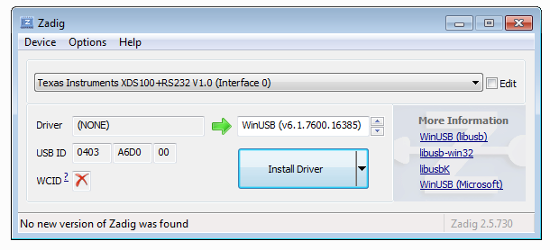
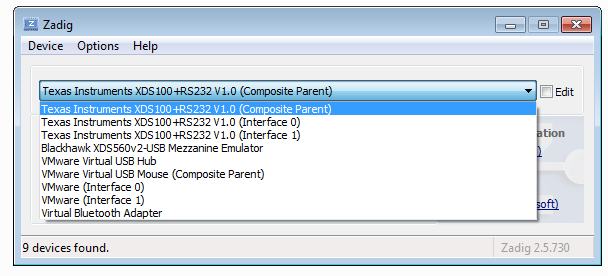
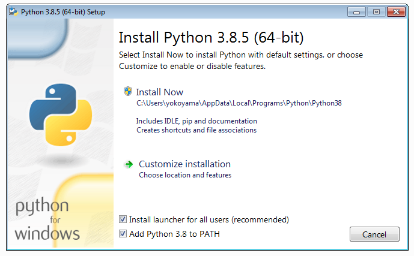
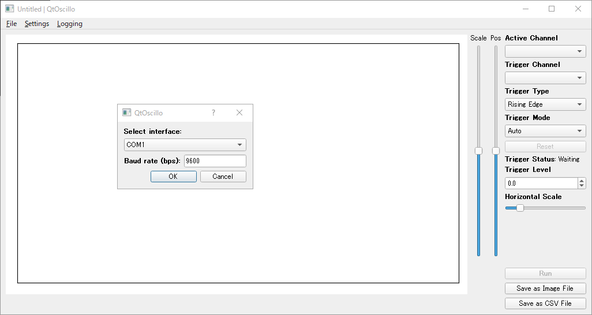
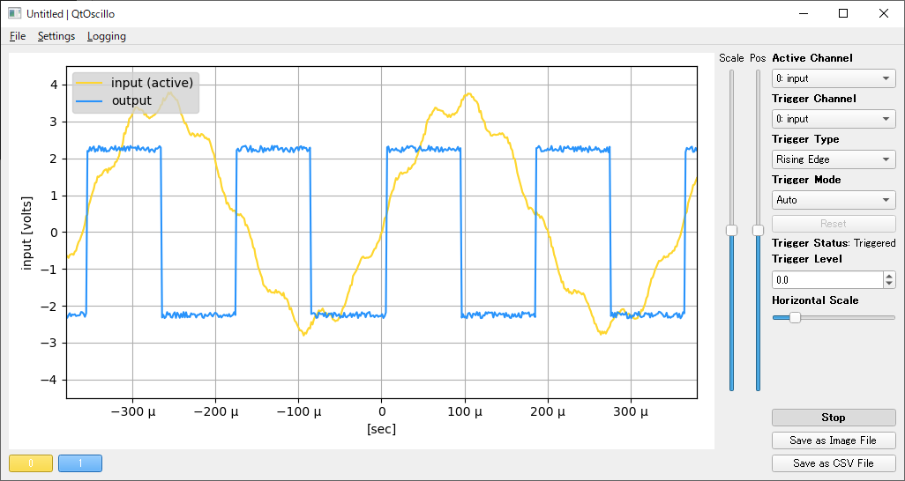

# QtOscillo（GUI版OscilloDSP）利用マニュアル（1.1版）

## 目次

* [はじめに](#はじめに)
* [Pythonアプリケーションとしてのインストール方法](#pythonアプリケーションとしてのインストール方法)
   * [FTDIドライバのインストール（オプション）](#ftdiドライバのインストールオプション)
   * [Pythonのインストール](#pythonのインストール)
   * [ライブラリの削除（オプション）](#ライブラリの削除オプション)
   * [必要なPythonライブラリのインストール](#必要なpythonライブラリのインストール)
* [利用方法](#利用方法)
   * [DSP側の設定](#dsp側の設定)
   * [アプリケーションの起動](#アプリケーションの起動)
   * [通信インターフェイスの設定](#通信インターフェイスの設定)
   * [オシロの実行](#オシロの実行)
   * [操作パネルの説明](#操作パネルの説明)
   * [メニューの説明](#メニューの説明)
* [PyInstallerを使って、Windowsアプリケーションを生成する方法](#pyinstallerを使ってwindowsアプリケーションを生成する方法)

## はじめに

QtOscilloは、Jupyter Notebookを使わずにOscilloDSP（仮想オシロスコープ）を利用するためのGUIソフトウェアです。

## Pythonアプリケーションとしてのインストール方法

ここでは、64ビット版Windows上にインストールする方法を説明します。

### FTDIドライバのインストール（オプション）

TI DSP評価ボード上などにあるFTDIチップを介して、ターゲットプロセッサと高速に通信をしたい場合には、FTDIチップ用のドライバをインストールする必要があります。

なお、これはオプションであり、インストールしなくてもCOMポートなどを経由して、115.2kbps等で接続することも可能です。

USBドライバを容易に切り替えられるよう、[Zadig](https://zadig.akeo.ie/)というツールを使います。ウェブサイトからツールをダウンロードし、実行します。（今回はバージョン 2.5 を使用しました。）



C6678 EVMボード上の（子亀のメザニンエミュレータではなく）ボード本体にあるUSBコネクタをパソコンに接続します。
その際、ヘッダピンを設定して、DSPのUARTがFT2232Hと繋がるようにしておきます。
（工場出荷時は、そのようになっています。）

続いて、EVMボードに電源を投入します。
PyFtdiのサイトの説明に従い、

1. メニューからOptions → List All Devicesをチェックします。
2. Options → Ignore Hubs or Composite Parentsのチェックを外します。
3. ドロップダウンメニューから、「Texas Insturuments XDS100+RS232 V1.0 (Composite Parent)」を選びます。



4. Driverと表示されている右に、赤い矢印の両脇に「現在のドライバ」と「インストールしたいドライバ」が表示されていますので、インストールしたいドライバとしてlibusb-win32を選びます。（上下の小さい三角ボタンで選択できます。）
5. Repace Driverボタンをクリックします。
6. しばらく反応がありませんが、数十秒ほど待ちます。
7. Warning - System Driverという警告が出ますが、Yesボタンを押してインストールします。
8. Zadig を終了します。
9. コントロールパネルからデバイスマネージャを開き、libusb-win32 devicesというツリーの下に正しく設定されていることを確認します。

### Pythonのインストール


> **注意**: 他のバージョンのPythonがインストールされている場合には、それをアンインストールしておきます。
> この理由から、OscilloDSP専用のパソコンを用意するほうが安心ですが、もし御興味があれば、[pyenv for Windows](https://github.com/pyenv-win/pyenv-win) などが役に立つかも知れません。
> pyenv for Windowsでは、パソコン上に複数のバージョンのPythonをインストールし、使い分けることができます。

[ここ](https://www.python.org/downloads/windows/)のウェブサイト から、Pythonをダウンロードします。
今回はPython 3.8.5 Windows x86-64 executable installerを使用します。
より新しいバージョンでも動作する可能性がありますが、前回のリリースと同様のバージョンを利用することにしました。

インストールの際は、以下の画面で「Add Python 3.8 to PATH」にチェックマークを入れ、Install Nowをクリックします。



### ライブラリの削除（オプション）

この、ライブラリ削除はオプション（つまり、必ずしも削除しなくて良い）ですが、動作を確実にしたい場合はインストール済みのライブラリを削除しておくことをお勧めします。
ただし、他のPython利用者の環境に影響を与える可能性がありますので、**よく確認の上、実行してください。**

**ライブラリの削除方法**:
```
Z:\yokoyama> python -m pip freeze >> erase.txt
Z:\yokoyama> python -m pip uninstall -r erase.txt -y
```

上記でエラー`ERROR: You must give at least one requirement to uninstall (see "pip help uninstall")`が出た場合、無視して結構です。

続いて以下のコマンドを実行し、何も表示されなければ削除は完了です。

```
Z:\yokoyama> python -m pip freeze
```

もし何か表示された場合は、上記のライブラリ削除方法を繰り返してみてください。

### 必要なPythonライブラリのインストール

まず、今回提供させて頂くOscilloDSPのパッケージ（`oscillodsp_*.zip`など）を展開します。

Windowsのcmd.exeを実行し、いわゆるDOS窓を開きます。
展開したパッケージは次のようなディレクトリ構成になるので、最上位のoscillodsp ディレクトリ（hostapp下のoscillodspではありません）に`cd`します。

```
oscillodsp
|-- hostapp
|   |-- oscillodsp
|   `-- tests
|-- pcsim
|-- protobuf
|-- tools
`-- workspace
    `-- oscillodemo
```

以下のようにして、必要なライブラリをインストールします。

**注意**: 今回は、Jupyter用のライブラリはインストールしません。
インストールしたい場合は、以下の`requirements_wo_jupyter.txt`を`requirements.txt`に変更してください。
ただし、後でPyInstallerを実行する際に、実行ファイルに不要なライブラリが含まれる可能性がありますので、推奨しません。

```
Z:\yokoyama\oscillodsp> python -m pip install -U --user -r hostapp\requirements_wo_jupyter.txt
```
次のような画面となり、数分でインストールが完了します。

```
Z:\yokoyama\oscillodsp> python -m pip install -U --user -r hostapp\requirements_wo_jupyter.txt
Collecting matplotlib==3.1.3
  Downloading matplotlib-3.1.3-cp38-cp38-win_amd64.whl (9.1 MB)
     |████████████████████████████████| 9.1 MB 2.2 MB/s
Collecting pyftdi==0.51.2
  Downloading pyftdi-0.51.2-py3-none-any.whl (150 kB)
     |████████████████████████████████| 150 kB 6.8 MB/s
Collecting pyserial==3.4
  Downloading pyserial-3.4-py2.py3-none-any.whl (193 kB)
     |████████████████████████████████| 193 kB 6.4 MB/s
Collecting protobuf==3.12.2
  Downloading protobuf-3.12.2-py2.py3-none-any.whl (443 kB)
     |████████████████████████████████| 443 kB 6.8 MB/s
Collecting grpcio-tools==1.30.0
  Downloading grpcio_tools-1.30.0-cp38-cp38-win_amd64.whl (1.6 MB)
     |████████████████████████████████| 1.6 MB 3.3 MB/s
（略）
```

いくつか警告が出る場合がありますが、通常は無視して問題ありません。

## 利用方法

### DSP側の設定

前回と説明が重複となりますので、ここでは省略します。[OscilloDSP の使い方](./usage.ipynb)等を御参考ください。

### アプリケーションの起動

次のようにコマンドを実行します。

```
Z:\yokoyama\oscillodsp> cd hostapp
Z:\yokoyama\oscillodsp\hostapp> python qtoscillo.py
```

次のような画面が開きます。
（うまく開かない場合は、お問い合わせください。
その際、スクリーンキャプチャ等を添付お願いします。）



### 通信インターフェイスの設定

最初に起動した場合には、通信インターフェイスの設定ダイアログが自動的に開きます。
開かない場合は、メニューからSettings → Interface...を選んでください。


FTDIインターフェイスを使う場合は、適切なインターフェイスを選んでください。
（ここでは、`ftdi://ftdi:0xa6d0:TIU72PWC/2`を選びます。）

Baud rate (bps)には、2000000など、適切な通信速度（bps）を入力してください。

最後にOKボタンをクリックします。

### オシロの実行

続いて、DSP側が動作していることを確認した後、画面上のRunボタンをクリックします。
例として、次のような画面が表示されれば正常です。



### 操作パネルの説明

前回のJupyterアプリ版の[マニュアル](./usage.ipynb)も併せて御参考ください。

- **Active Channel**: オシロ波形左側に表示される縦軸表示を、指定したチャネル用に変更します。
なお、スライダScaleやPosも、Active Channelで選択したチャネルに対して有効となります。

- **Trigger Channel**: トリガ用のチャネルを選択します。

- **Trigger Type**: トリガタイプ（Rising Edge、Falling Edge）を選択します。

- **Trigger Mode**: トリガモードを選択します。
3つのモードから選択できます。

  - Auto: 自動モード（トリガが掛かっているときは、トリガに従って表示します。
    トリガが掛かっていないときは、常に最新のデータを表示し続けます。）
  - Normal: ノーマルモード（トリガが掛かっていない場合は、画面の更新が止まります。
    DSP からデータが送られません。）
  - Single: シングル（ワンショット）モード（トリガが掛かると画面の更新が止まります。
    「Reset」ボタンを押すと、再度トリガ待ちになります。）

- **Reset**ボタン: トリガモードがSingleの時、トリガをリセットして再トリガを待ちます。

- **Trigger Level**: トリガレベルです。単位は物理量（ボルトやアンペア）です。

- **Horizontal Scale**: 時間軸のスケール調整です。

- **Scale**, **Pos**: Active Channelで選択しているチャネルの、縦軸スケールおよび位置を調整します。

- **Run**あるいは**Stop**: オシロを開始、あるいは停止します。

- **Save as Image File**: 波形をPNG画像ファイルとして保存します。

- **Save as CSV File**: 表示している波形の元データをCSV形式で保存します。

- **チャネル表示選択ボタン**: 画面下に表示されているボタンです。
トグル形式となっており、クリックすると当該チャネルが非表示になります。
再度クリックすると、表示が戻ります。

### メニューの説明

#### Fileメニュー

- **Quit QtOscillo**: アプリを終了します。なお、アプリ画面のクローズボックスをクリックしても終了します。未保存の設定（後述のSettings）がある場合には、確認のダイアログが出ますので、必要であれば保存します。

#### Settingsメニュー

- **New**: 設定を初期状態に戻します。
この際、通信インターフェイスを選択するためのダイアログが表示され、再設定が必要となります。

- **Load...**: 保存済みの設定をロードします。
ウィンドウ画面最上部に、設定ファイルの名前が表示されます。

- **Save**, **Save As...**: 設定をファイルに保存します。

- **Interface...**: 通信インターフェイス、および通信速度を指定します。
選択した通信インターフェイスで設定できない速度を指定するとエラーになります。

- **Channel Colors...**: 波形を表示する色を、チャネル毎に変更できます。
チャネル番号を表示しているボタンをクリックし、色を選択した後、OKボタンをクリックしてください。

#### Loggingメニュー

- **View log...**: システムログを表示するウィンドウを開きます。

  Autoscrollボタンのチェックを外すと、自動スクロールが停止します。

  Application Log Levelでは、オシロアプリのログ表示レベルを設定できます。
  デフォルトではDisabled（無効）です。

  DSP Driver Log Levelでは、DSPドライバ（DSPとの通信を制御するPythonライブラリ）のログ表示レベルを設定できます。
  こちらも、デフォルトではDisabled（無効）です。

  なお、上記のログレベル設定は、通常では設定ファイルに保存されません。
  （これは、誤って冗長なログレベル設定により、ディスクが一杯になってしまうことを防ぐための設計です。）
  ただし、Set the Log Levels as the defaultボタンのチェックを入れることで、SettingsメニューのSave、あるいはSave As...で保存されるようになります。
  （チェックボックスに入れた後に、明示的にSettingsを保存する必要があります。）

## PyInstallerを使って、Windowsアプリケーションを生成する方法

まず最初に、PyInstallerをインストールします。
以下のようにすると最新版のPyInstallerがインストールされます。

```
Z:\yokoyama\oscillodsp> python -m pip install -U --user pyinstaller
```

もし、動作確認済みのバージョンを試したい場合は、以下のようにバージョン4.3を明示的に指定してください。

```
Z:\yokoyama\oscillodsp> python -m pip install -U --user pyinstaller==4.3
```

続いて、実際にWindowsアプリケーション（.exe形式実行ファイル）を生成します。

```
Z:\yokoyama\oscillodsp> python -m PyInstaller qtoscillo.spec
```

サブディレクトリに、`dist\qtoscillo\qtoscillo.exe`が生成されます。
cmd.exeからも実行できますし、ファイルエクスローラーでダブルクリックしても実行できます。
必要であれば、デスクトップ等にエイリアスを作成すると便利かと思います。

なお、PyInstallerで生成した実行ファイルが正しく動作しない場合は、`qtoscillo.spec`ファイルをテキストエディタで編集し、

```
debug=False,
（略）
console=False)
```

という部分をそれぞれ

```
debug=True,
（略）
console=True)
```

に変更し、再度PyInstallerを実行してください。

その後、cmd.exeから

```
Z:\yokoyama\oscillodsp> dist\qtoscillo\qtoscillo.exe
```

のように実行し、cmd.exeの画面にエラーメッセージが出たら、それをコピーしてお送りください。
確認させて頂きます。

御不明な点がございましたら、お気軽にお問い合わせください。（[yokoyama@flogics.com](mailto:yokoyama@flogics.com)）

[ドキュメントここまで]
